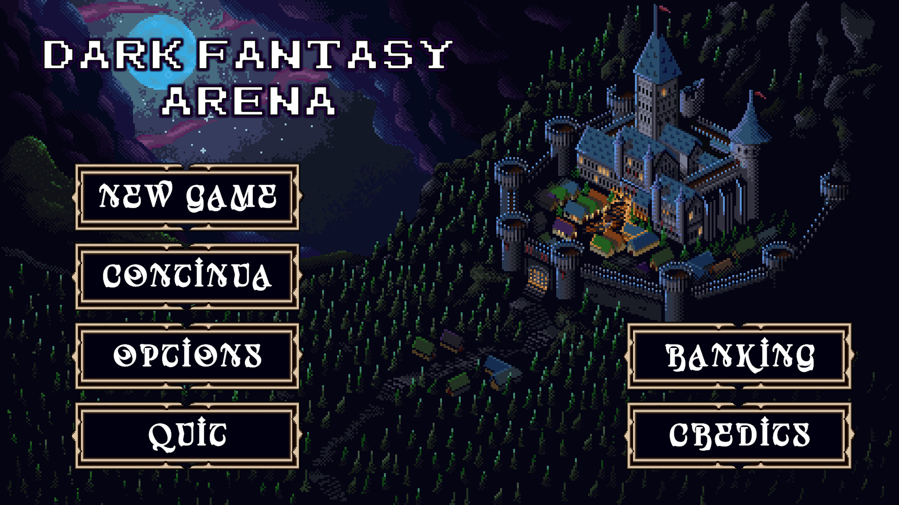
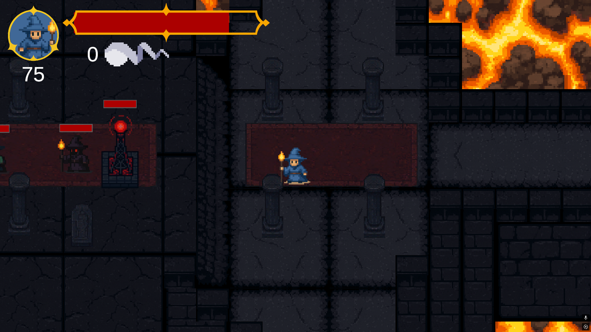
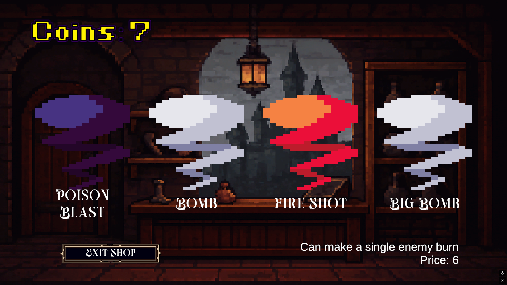

# 🎮 Dark Fantasy Arena

## Informazioni generali

### Titolo 
Dark Fantasy Arena
### Genere
Dark Fantasy, Arena
### Piattaforma 
PC
### Motore di gioco
Unity
### Lingua
Italiano
### Stato del progetto
Completo
### Periodo di sviluppo
Ottobre 2025

## Autori:

Trezzoto (GitHub)
davyrap

### 🧩 Concept e Ambientazione

Dark Fantasy Arena è un videogioco ambientato in un castello oscuro e opprimente, caratterizzato da un’estetica dark fantasy con stile grafico pixel art. L’ambientazione punta a trasmettere un senso di decadenza, mistero e pericolo costante, tipico del genere.

Il gioco non segue un concept narrativo complesso o articolato: l’obiettivo principale è offrire un’esperienza di combattimento in arena immersa in un contesto cupo e fantasy.

### Lore (accennata)

La lore non è sviluppata in modo approfondito, trattandosi di una demo.
Il giocatore interpreta un mago, intrappolato in un castello apparentemente infinito, il cui scopo è sconfiggere il Mago Supremo. Al momento, il boss finale non è ancora implementato, lasciando la narrazione volutamente aperta.

## 🗺️ Struttura del gioco (Scene)

Il gioco è suddiviso in diverse scene, ognuna con uno scopo specifico all’interno dell’esperienza di gioco.

### Main Menu

Scena iniziale del gioco. Da qui il giocatore può:

- Avviare una nuova partita

- Continuare una partita salvata

- Accedere alle opzioni

- Visualizzare la classifica

- Uscire dal gioco

### Arena 

Prima arena di combattimento.
Qui il giocatore affronta ondate di nemici utilizzando le proprie spell magiche.
La difficoltà e il numero di nemici aumentano progressivamente con il livello.

### Option

Scena dedicata alle opzioni di gioco, dove il giocatore può configurare le impostazioni disponibili (es. controlli, audio, ecc.).

### Ranking

Scena che mostra la classifica finale, basata sullo score ottenuto durante le partite.

### Continue

Permette al giocatore di riprendere l’ultima partita dal livello salvato, grazie al sistema di salvataggio.

### Game Over / Victory

Scena mostrata al termine della partita:

- Game Over in caso di sconfitta

- Victory in caso di completamento degli obiettivi disponibili nella demo

### Shop

Scena dedicata all’acquisto di nuove spell e potenziamenti, utilizzando le risorse ottenute durante il gameplay.

## ⚔️ Gameplay e Meccaniche
### Sistema di combattimento

Il combattimento è a distanza, coerente con il ruolo del giocatore che interpreta un mago.
Il gameplay è basato sull’uso strategico delle spell e sul posizionamento all’interno dell’arena.

### Controlli

Sono disponibili due modalità di controllo:

### Modalità 1

Movimento: Frecce direzionali

Attacco: E

Modalità 2

Movimento: WASD

Attacco: I

### Armi e abilità

Le spell sono gestite tramite:

- Z X C con una modalità di controllo

- J K L con l’altra modalità

Le spell rappresentano le principali abilità offensive del giocatore.

### Sistema di progressione

Livelli: il giocatore avanza di livello affrontando le arene

Score: utilizzato per determinare la posizione nella classifica finale

Potenziamenti: applicabili esclusivamente alle spell

### Intelligenza artificiale dei nemici

IA base: i nemici inseguono direttamente il giocatore (chase)

IA avanzata: i nemici calcolano la traiettoria prevista del giocatore, anticipando la sua prossima posizione

### Difficoltà

Sono disponibili tre livelli di difficoltà:

- Facile

- Medio

- Difficile

La difficoltà è incrementale e aumenta con il livello di gioco.

### Elementi Dark Fantasy nel gameplay

Utilizzo di spell magiche oscure

Ambientazioni cupe e oppressive

## 🧙 Personaggi ed Entità
### Personaggio giocabile

Il giocatore interpreta un mago che può acquistare nuove spell all’interno dello shop.
Il personaggio presenta:

- Grande potenziale offensivo

- Debolezze specifiche contro determinati tipi di nemici

### Nemici

- Mago Nero: utilizza spell di fuoco

- Mago del Veleno: attacca con spell velenose

- Mago Burst: utilizza spell ad alto danno esplosivo

Ogni nemico presenta pattern di attacco differenti.

## 🎨 Grafica e Audio

Stile grafico: Pixel Art

Animazioni: Basilari

Musiche: Brani senza copyright reperiti su YouTube

Effetti sonori: Asset no-copyright trovati online

Fonti di ispirazione: Utilizzo di AI generativa come supporto creativo

## 🛠️ Aspetti Tecnici

Sistema di salvataggio: memorizza l’ultimo livello completato

Ottimizzazione: utilizzo dell’Object Pooling per la gestione efficiente dello spawn dei nemici a runtime

## ▶️ Installazione e Avvio

Una volta scaricato il progetto, è possibile buildare autonomamente il gioco in base al dispositivo di destinazione.

Il gioco è stato pensato e testato principalmente per sistemi operativi Windows.
Dalla repository (tramite pull del progetto) viene fornito l’intero progetto Unity, permettendo così:

Apertura diretta tramite Unity Hub

Modifica o analisi del codice

Build personalizzata per la piattaforma desiderata

⚠️ Nota: il supporto ufficiale è orientato a Windows.

## 🤝 Collaborazione e Suddivisione dei Ruoli

Il progetto è stato sviluppato da due game developer, con una ripartizione equilibrata dei ruoli tra design, programmazione e sviluppo generale.

La realizzazione è stata possibile grazie all’utilizzo di Git, con sincronizzazione costante del progetto tramite repository condivisa.
Questo approccio ha permesso una collaborazione efficace e un flusso di lavoro ordinato durante tutto lo sviluppo.

## 🙏 Crediti e Ringraziamenti

Ispirazioni:

Dark Fantasy

Sistemi di combattimento magici a distanza

Strumenti utilizzati:

Unity – Motore di gioco

Aseprite – Creazione dei modelli pixel art dei personaggi

## Contesto del progetto:
Il gioco è nato come demo per la consegna di un progetto per l’esame di
“Sviluppo di Giochi Digitali”
presso DMI – Università degli Studi di Catania (UNICT).

## Ringraziamenti speciali:
Un sentito ringraziamento a davyrap, per il fondamentale supporto e il grande contributo fornito durante tutta la realizzazione del progetto.
