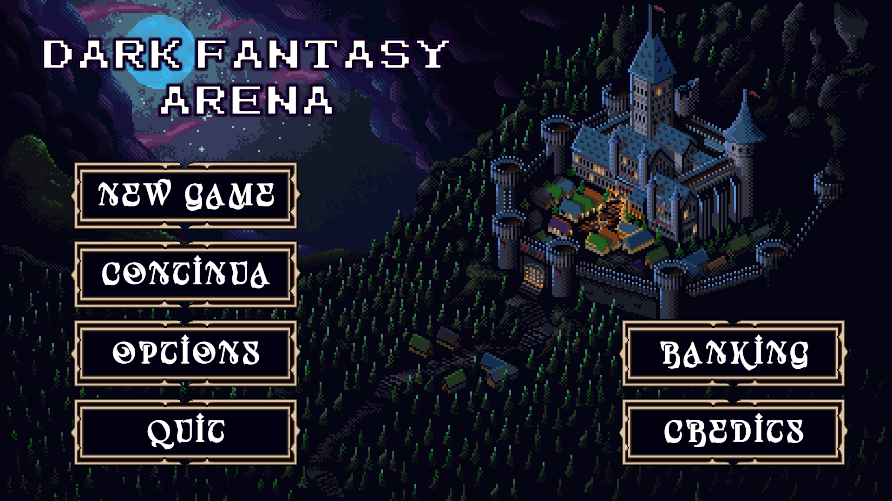
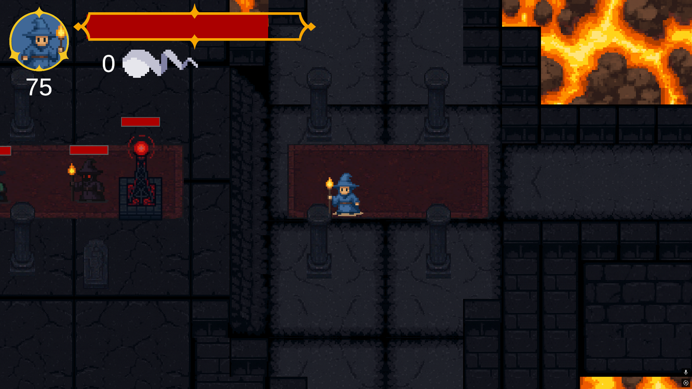
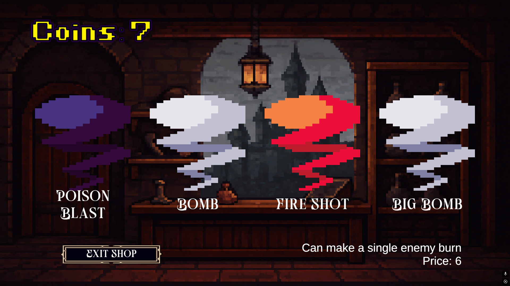

# 🎮 Dark Fantasy Arena

**Dark Fantasy Arena** is a 2D pixel-art dark fantasy arena game set in a gloomy, oppressive castle. Developed as an exam project for "Sviluppo di Giochi Digitali" at DMI – University of Catania (UNICT), the game focuses on intense ranged magical combat against waves of enemies.

## 📦 Technologies

- Unity
- C#
- Aseprite (Pixel Art)
- Git & GitHub

## 🦄 Features

Here's what you can experience in Dark Fantasy Arena:

- **Immersive Dark Fantasy Setting:** Battle through waves of enemies inside an endless castle with a distinct pixel-art aesthetic.
- **Ranged Magical Combat:** Control a wizard utilizing strategic spells and positioning to survive.
- **Multiple Control Schemes:** Fully configurable controls supporting either Arrow keys + `E` / `Z X C` or `WASD` + `I` / `J K L`.
- **Diverse Enemy AI & Types:** Face specialized enemies like the Black Wizard (fire spells), Poison Wizard, and Burst Wizard featuring both chase and predictive trajectory AI.
- **Progression & Shop:** Earn scores, clear levels, and purchase powerful spell upgrades at the in-game Shop.
- **Multiple Game Modes & Options:** Includes Main Menu, three difficulty levels (Easy, Medium, Hard), a persistent Save/Continue system, and a Ranking scoreboard.

---

### 🗺️ Game Scenes & Overview

- **Main Menu:**
  
  Launch new games, continue saved progress, open options, view rankings, or exit.
- **Arena:** 
  
  The primary combat zone where you face escalating waves of enemies using magical spells.
- **Shop:** 
  
  Spend earned resources to acquire new spells and power-ups.
- **Options, Ranking & Continue:** Dedicated scenes for game settings, high scores, and persistent session loading.

## 🚢 The Process & Architecture

- **Object Pooling:** Implemented efficient runtime object pooling to manage enemy spawning smoothly and maintain high performance.
- **Save System:** A persistent system that records player progress and stores the last completed level.
- **Modular Scene Architecture:** Clean separation of concerns across Main Menu, Arena, Shop, Options, Ranking, and Game Over/Victory scenes.

## 🚦 Running the Project

To run the project in your local environment:

1. Clone the repository to your local machine.
2. Open the project folder using **Unity Hub**.
3. Build or run the project (optimized and tested primarily for Windows).

## 👥 Authors & Context

Developed in October 2025 as a demo project for the "**Sviluppo di Giochi Digitali**" exam at DMI – Università degli Studi di Catania (UNICT).

- **Trezzoto** (GitHub)
- **davyrap** (Special thanks for the fundamental support and contribution throughout development)
